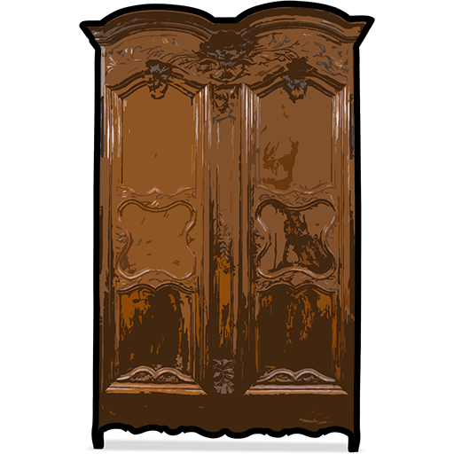

# Project Armoire
##### _Open-source, cross-platform, hacky._

## About
**Project Armoire** is an open-source, cross-platform multiplayer RPG sandbox built with the [Flame](https://flame-engine.org) + [Bonfire](https://bonfire-engine.github.io) engines on top of [Flutter](https://flutter.dev). Pick a username, roam tile-based biomes, and watch other players move around you in real time over a serverless [PubNub](https://www.pubnub.com) backbone. One codebase runs in the browser and on Windows, macOS, and Android.

> Started as "an attempt at building something open source, cross-platform and hacky." It is a tech-demo playground rather than a finished game — expect rough edges.

## Features
- 👥 **Real-time multiplayer** — see other players join and move, peer-to-peer over PubNub, no server
- 🌍 Tile-based biome maps authored in Tiled, with seamless map-to-map transitions
- 🕹️ Virtual joystick + keyboard controls, plus an action / cast button
- 🧝 Eight-direction sprite-sheet hero animations — idle, run, cast
- 🌊 Environmental effects — water slows you and cloaks your sprite
- 🧭 45° rotated camera with map-bounded follow
- 📱 One Flutter codebase — Web, Windows, macOS, Android, iOS
- 🎮 Pick a username and drop straight into the shared world

### Links

    
     
    <strong>Play:</strong>
     
    
    
    
    
     
    <strong>Source Code:</strong>
     
    
     
    

## Documentation

See the [full documentation](docs/index.md) for guides on the game and its code:

- [Controls](docs/playing/controls.md)
- [Gameplay](docs/playing/gameplay.md)
- [Multiplayer](docs/multiplayer.md)
- [Architecture](docs/development/architecture.md)
- [Build & CI](docs/development/build.md)
- [Changelog](CHANGELOG.md)

## Built with
    

## License

No `LICENSE` file is present yet — treat this as source-available and ask before reuse.
